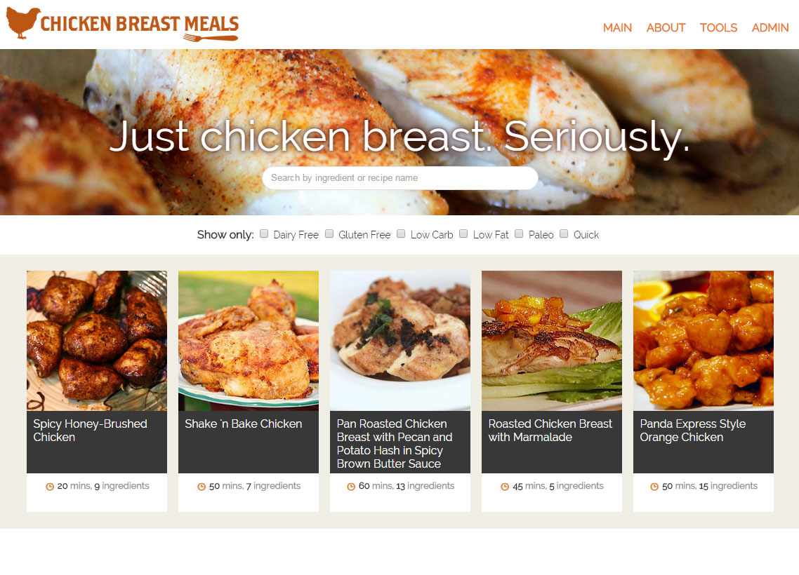
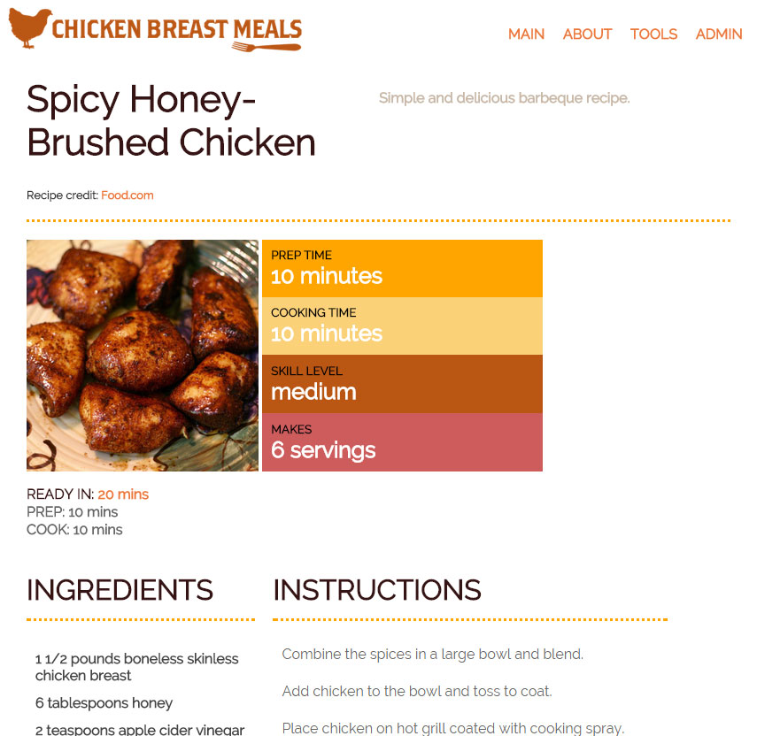

ChickenBreastMeals.com
======================

Chicken Breast Meals is a recipe website I designed and developed using AngularJS, Node, Express, MongoDB, and other web technologies. 

**TRY IT LIVE**
[Chicken Breast Meals on Heroku](http://chickenbreastmeals.herokuapp.com)

**Screenshots:**

**Setup and Installation**

1. Clone this repo
2. *npm install*
3. *npm install -g bower*
4. *npm install -g protractor*
5. *bower install*
6. In a separate terminal window, start mongoDB: *mongod*
7. In a separate terminal window, start webdriver: *webdriver-manager start* (for e2e tests)
8. In a separate terminal window, start the server: *grunt default*

**Use**

Now you should be able to see the app in browser: *http://localhost:3000*

**Tests**
* Run karma tests: *grunt default*
* Run e2e tests: *protractor protractor.conf.js*

