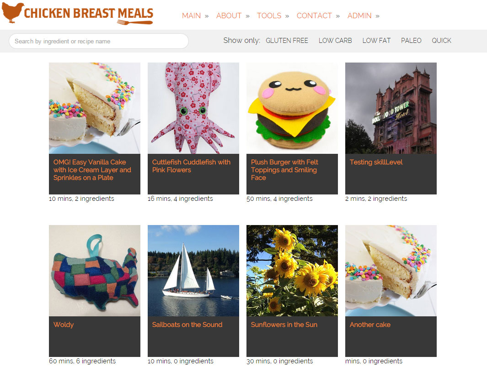
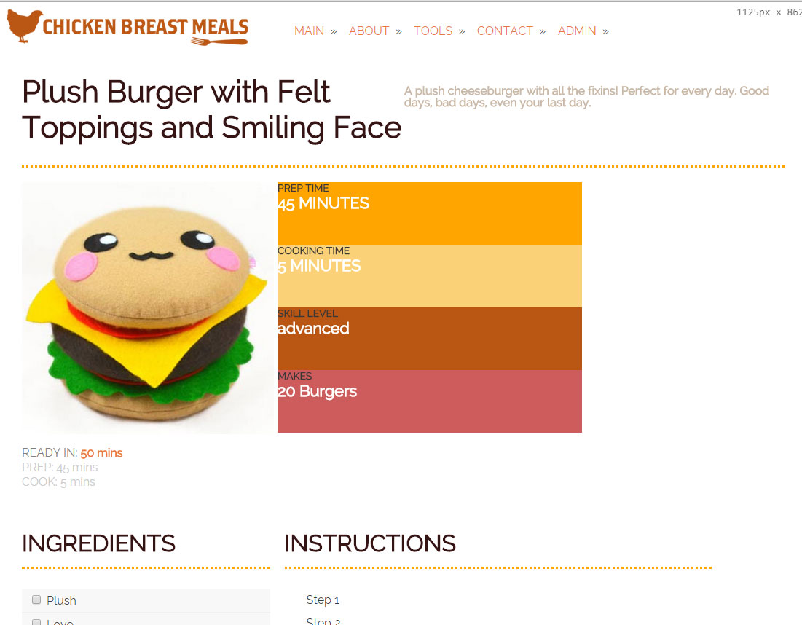

ChickenBreastMeals.com
======================

Chicken Breast Meals is a recipe website I designed and developed using AngularJS, Node, Express, MongoDB, and other web technologies. 

To use:
1. Clone the repo to your local environment
2. Run *npm install*
3. Run *bower install*
4. Type *grunt default*
5. Open *http://localhost:3000*

Screenshots:

